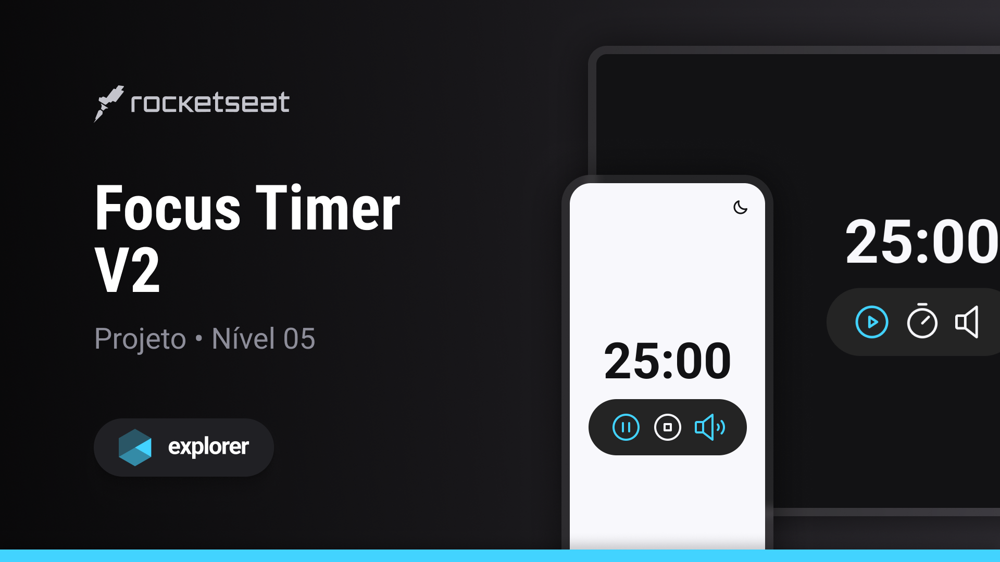

<h1 align="center"> FocusTime </h1>

Projeto promovido pela Rocketseat na trilha Explorer para ensino de tecnologias WEB, usando lógica de programação em JavaScript

  <a href="#-tecnologias">Tecnologias</a>&nbsp;&nbsp;&nbsp;|&nbsp;&nbsp;&nbsp;
  <a href="#-projeto">Projeto</a>&nbsp;&nbsp;&nbsp;|&nbsp;&nbsp;&nbsp;
  <a href="#-layout">Layout</a>&nbsp;&nbsp;&nbsp;|&nbsp;&nbsp;&nbsp;
  <a href="#memo-licença">Licença</a>

  

 

## 🚀 Tecnologias

Esse projeto foi desenvolvido com as seguintes tecnologias:

- HTML e CSS
- Git e Github
- JavaScript
- Figma

## 💻 Projeto

FocusTime é um projeto WEB para fins de estudo de tecnologias WEB, trazendo o concenito inspirado em pomodoro de marcação de intervalos de tempo, dando a possibilidade do usuário escolher o intevalo de tempo desejado em minutos, com toque de alarme e a possibilidade de música no ambiente, ainda com modo claro e escro de tela.

## 🔖 Layout

Você pode visualizar o layout do projeto através [DESSE LINK](<https://www.figma.com/file/i43z7s6LKdrPOCkPd9p5AF/Focus-Timer-V2-%E2%80%A2-Projeto-Explorer-(Community)?node-id=1422%3A28&mode=dev>). É necessário ter conta no [Figma](https://figma.com) para acessá-lo.

## 📝 Licença

Esse projeto está sob a licença MIT.

---

Feito com ♥ by Rocketseat :wave: [Participe da nossa comunidade!](https://discord.gg/rocketseat)
